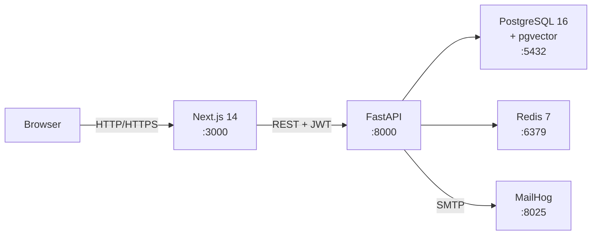

# TalentBridge

> Intelligent job portal — smart matching between HR teams and candidates, powered by semantic search and structured fit scoring.

---

## 1. Project Overview

TalentBridge is a full-stack job portal built for modern recruitment workflows. HR teams post jobs and use AI-powered search to rank candidates by a blended match score (skills overlap, semantic similarity, experience fit, salary fit). Candidates get a personalised job feed with per-card match scores, resume auto-fill, and a live application tracker.

## Demo- https://drive.google.com/file/d/15mWs1Uai0utDlXyc5wScHrl5SseDMp4s/view?usp=sharing
---

## 2. Architecture



| Component | Role |
|---|---|
| **Next.js 14** | App Router, TypeScript, Tailwind, shadcn/ui, TanStack Query, Zustand |
| **FastAPI** | Async REST API, JWT auth, RBAC, OpenAPI docs |
| **PostgreSQL + pgvector** | Relational data + vector embeddings for semantic matching |
| **Redis** | Refresh token store, rate-limit counters |
| **MailHog** | Dev SMTP catcher — all emails visible at `:8025` |

See [docs/architecture.md](docs/architecture.md) for detailed dataflow and auth sequence.

---

## 3. How to Run

```bash
git clone <repo-url>
cd talentbridge
cp .env.example .env       # defaults work out of the box
docker compose up --build
```

| Service | URL |
|---|---|
| Web app | http://localhost:3000 |
| API docs (Swagger) | http://localhost:8000/docs |
| MailHog UI | http://localhost:8025 |

---

## 4. Test Credentials

Seeded automatically on first boot:

| Role | Email | Password |
|---|---|---|
| HR | `hr@test.com` | `Hr@12345` |
| Candidate | `candidate@test.com` | `Candidate@12345` |

---

## 5. Feature Walkthrough

### As HR
1. Log in → HR dashboard with job pipeline overview
2. **Post a job** — fill title, description, required skills, salary band
3. **Find Candidates** — paste a JD or set structured filters → ranked candidate list with score breakdowns
4. Select candidates → **Bulk Invite** → personalised emails queued (view in MailHog)
5. **Kanban board** — drag candidates across stages: Applied → Shortlisted → Interview → Offered/Hired/Rejected
6. **Analytics** — per-job funnel, skill demand heatmap, pipeline summary table

### As Candidate
1. Log in → personalised job feed with match scores on every card
2. **Upload Resume** — PDF/DOCX → auto-fills skills, experience, past companies
3. **Complete Profile** — profile completeness meter drives better matches
4. Click a job → see score breakdown ("You match 87% — missing: Kubernetes")
5. **Apply** — cover letter optional; track status in Application Tracker

---

## 6. Tech Stack

| Layer | Technology |
|---|---|
| Frontend | Next.js 14, TypeScript, Tailwind CSS, shadcn/ui, TanStack Query, Zustand, React Hook Form, Zod |
| Backend | FastAPI (Python 3.11), SQLAlchemy 2.0, Pydantic v2, Alembic |
| Database | PostgreSQL 16, pgvector |
| Cache | Redis 7 |
| Auth | JWT (python-jose) + bcrypt (passlib) |
| Email (dev) | MailHog |
| Matching | TF-IDF (scikit-learn) + sentence-transformers (all-MiniLM-L6-v2) |
| Parsing | pdfplumber, python-docx, spaCy |
| Tests | pytest + pytest-asyncio (backend), Vitest + RTL (frontend) |

---

## 7. Testing

```bash
# Backend tests (inside Docker)
docker compose exec api pytest -v

# Backend tests (locally, with venv active)
cd backend && pytest -v

# Frontend tests (inside Docker)
docker compose exec web npm run test

# Frontend tests (locally)
cd frontend && npm run test
```

---

## 8. Project Structure

```
talentbridge/
├── docker-compose.yml          # orchestrates 5 services
├── docker-compose.override.yml # dev hot-reload overrides
├── .env.example                # all vars documented
├── backend/
│   ├── Dockerfile              # multi-stage, non-root
│   ├── pyproject.toml
│   ├── alembic/                # DB migrations
│   └── app/
│       ├── main.py             # FastAPI app factory
│       ├── core/               # config, security, deps, exceptions
│       ├── db/                 # session, base, seed
│       ├── models/             # SQLAlchemy ORM
│       ├── schemas/            # Pydantic I/O schemas
│       ├── api/v1/routes/      # thin route handlers
│       └── services/           # business logic (framework-agnostic)
└── frontend/
    ├── Dockerfile              # multi-stage, standalone Next.js
    └── src/
        ├── app/                # App Router pages (auth / candidate / hr)
        ├── components/         # shadcn primitives + domain components
        ├── lib/                # api client, auth, zod schemas
        ├── hooks/
        └── stores/             # Zustand stores
```

See [docs/architecture.md](docs/architecture.md) for more detail.

---

## 9. Known Limitations

- Email sending captured by MailHog only — not wired to a real SMTP provider.
- Semantic embeddings computed on-demand; no batch reindex job when model updates.
- No password reset / forgot-password flow.
- Resume file serving is authenticated but served from a local Docker volume (not S3/CDN).
- LLM-assisted JD Writer is behind `ENABLE_LLM_JD_WRITER=true` flag and requires an OpenAI key — not enabled by default.
- No WebSocket for real-time pipeline updates; candidate status changes require a page refresh.
- Time-to-hire metric not implemented — the `Application` model stores only `created_at` (when applied), not individual status-change timestamps, so accurate time-to-hire cannot be derived.

---

## 10. Claude Code Notes

This project was scaffolded and built incrementally with Claude Code (claude-sonnet-4-6) following a strict one-feature-per-branch workflow defined in `CLAUDE.md`. Claude Code was used for:

- Generating the initial monorepo scaffold, Dockerfiles, and docker-compose configuration
- Implementing FastAPI routes, SQLAlchemy models, and Pydantic schemas to spec
- Writing the matching service (TF-IDF + sentence-transformers blend)
- Generating pytest test suites with async fixtures and transaction rollback isolation
- Reviewing and enforcing the security checklist (§8 of CLAUDE.md) at each step

All architectural decisions were human-reviewed before code was committed. Claude Code did not auto-commit or auto-push — every diff was inspected before merge.
